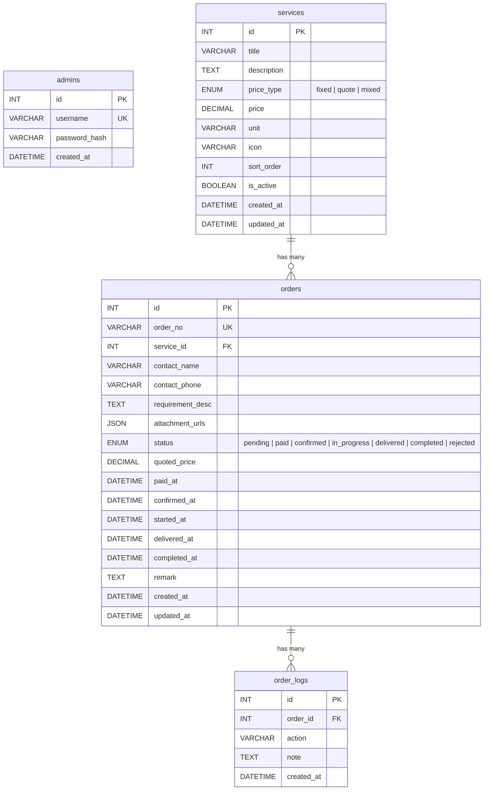
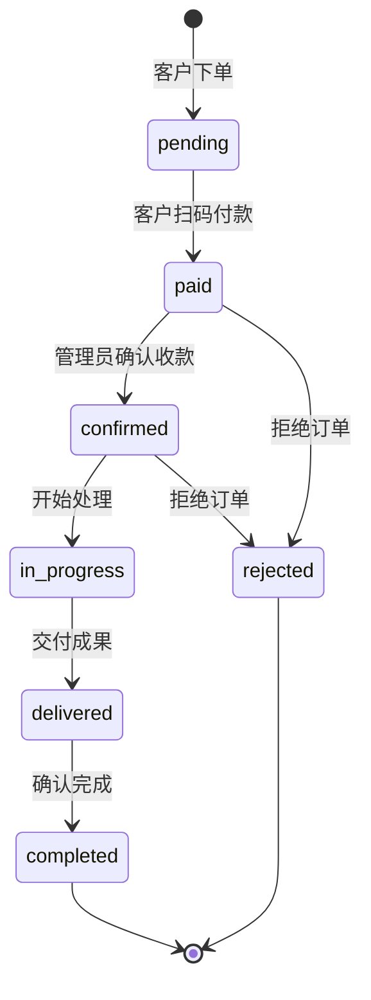

# 张千帆设计公司 — 兼职下单平台

个人接单展示站，客户浏览服务后直接下单，扫码付款，全程订单状态跟踪。

## 技术栈

| 层级 | 技术 |
|------|------|
| 前端 | Vue 3 + Vite + Vue Router + Pinia + TailwindCSS v4 |
| 后端 | Vercel Serverless Functions (Node.js) |
| 数据库 | MySQL 8.x (via Cloudflare Tunnel) |
| 认证 | JWT (管理员) |
| 部署 | Vercel (前端静态托管 + Serverless API) |

## 架构

```
用户浏览器
    ↓ HTTPS
Vercel (Vue3 SPA + Serverless Functions)
    ↓ MySQL 连接
Cloudflare Tunnel → Mac Mini:3306 (MySQL)
```

## ER 图



## 订单状态流转



## 页面结构

| 页面 | 路由 | 说明 |
|------|------|------|
| 首页 | `/` | Hero 渐变区 + 服务卡片网格 + 案例链接 + 联系方式 |
| 服务详情 | `/service/:id` | 服务介绍 + 下单表单 + 收款码 |
| 订单查询 | `/order/query` | 按订单号或手机号查询 |
| 订单状态 | `/order/:id` | 垂直时间线展示进度 |
| 管理登录 | `/admin/login` | 密码登录，JWT 鉴权 |
| 仪表盘 | `/admin` | 统计卡片（今日订单/收入/进行中） |
| 服务管理 | `/admin/services` | 服务 CRUD + 上下架 |
| 订单管理 | `/admin/orders` | 订单列表 + 状态操作 + 报价 |

## 项目结构

```
├── api/                          # Vercel Serverless Functions
│   ├── _lib/                     #   基础设施
│   │   ├── db.js                 #     MySQL 连接池
│   │   ├── auth.js               #     JWT 工具
│   │   └── response.js           #     统一响应格式
│   ├── services/                 #   公开 — 服务接口
│   ├── orders/                   #   公开 — 订单接口
│   └── admin/                    #   管理 — 需 JWT
│       ├── login.js
│       ├── services.js
│       ├── orders.js
│       ├── orders/[id].js
│       ├── logs.js
│       └── stats.js
├── src/                          # Vue3 前端
│   ├── views/                    #   页面
│   ├── components/               #   组件
│   ├── composables/              #   组合式函数 (useToast)
│   ├── stores/                   #   Pinia 状态
│   ├── api/                      #   Axios 请求封装
│   ├── router/                   #   Vue Router
│   └── assets/styles/            #   设计 Token + 全局样式
├── scripts/
│   ├── init-db.sql               # 数据库初始化 + 种子数据
│   └── seed-admin.js             # 管理员密码生成
├── public/qr/payment.jpg        # 收款二维码
├── server.js                     # 本地开发 API 服务器
├── vercel.json                   # Vercel 部署配置
└── vite.config.js                # Vite 构建配置
```

## 本地开发

```bash
# 1. 安装依赖
npm install

# 2. 初始化数据库（MySQL 需已运行）
mysql -u root < scripts/init-db.sql

# 3. 配置环境变量
cp .env.example .env
# 编辑 .env 填入数据库连接信息

# 4. 启动（需要两个终端）
npm run dev:api    # 终端 1：API 服务器 localhost:3000
npm run dev        # 终端 2：前端 localhost:5173
```

## 管理员账号

默认账号：`admin` / `admin123`

请上线前修改密码，运行 `node scripts/seed-admin.js 新密码` 生成新 hash。

## 环境变量

| 变量 | 说明 |
|------|------|
| `DB_HOST` | MySQL 主机（Cloudflare Tunnel 地址） |
| `DB_PORT` | MySQL 端口 |
| `DB_USER` | 数据库用户 |
| `DB_PASSWORD` | 数据库密码 |
| `DB_NAME` | 数据库名 |
| `JWT_SECRET` | JWT 签名密钥 |
| `PAYMENT_QR_URL` | 收款码图片路径 |

## 部署到 Vercel

1. Fork 或 push 到 GitHub
2. 在 [Vercel](https://vercel.com) 导入项目
3. 配置环境变量
4. 部署完成，自动构建前端 + Serverless Functions

## License

MIT
